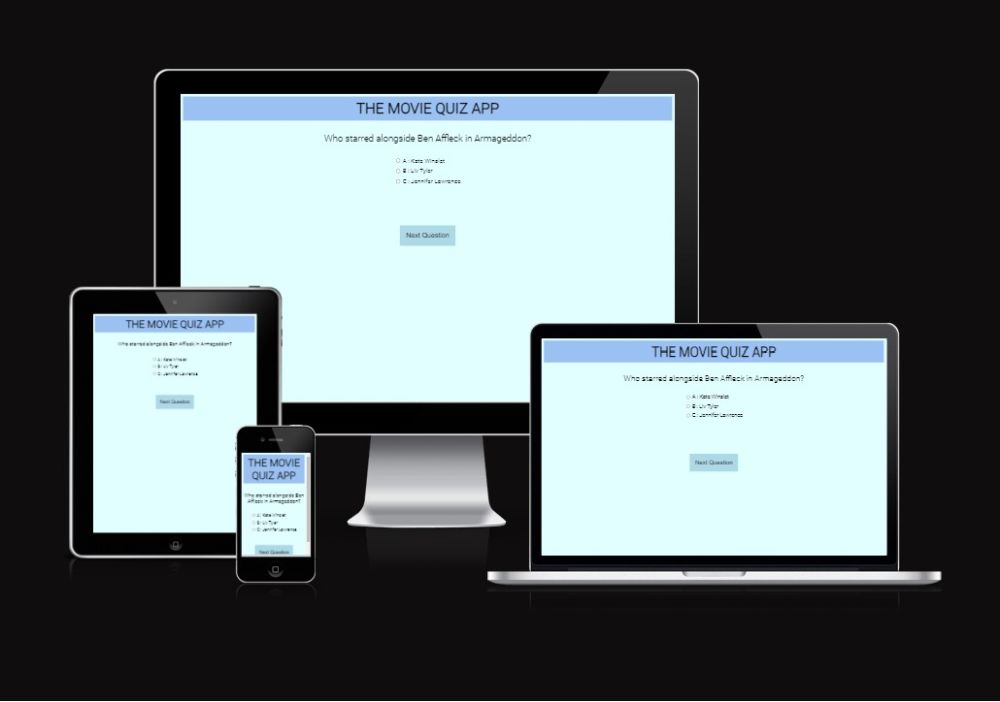
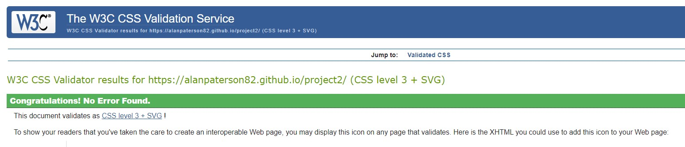
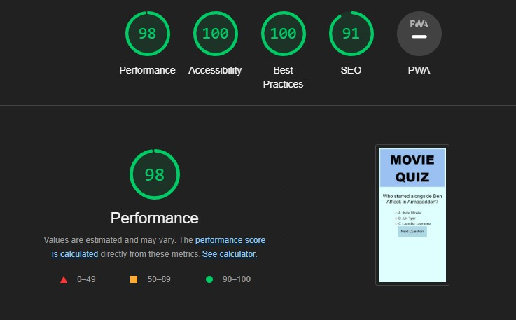

# The Movie Quiz App

I have created a very basic quiz that poses five movie based questions, with a 'next question' option once an answer has been provided. Once all five questions have been answered you will see your score out of five. If any are incorrect, all of the answers for that question will be highlighted red when you scroll back through and you will be able to amend your answer before submitting your attempt again. If correct, the answers will show as green.

A live demo of this project can be found at [Movie Quiz](https://8000-alanpaterson82-project2-052j5a4rw6.us2.codeanyapp.com/)

# Goals

- To use Javascript to create a basic quiz platform
- To make the design simple and user friendly
- To create an enjoyable quiz for all users
- To provide the user's final score and allow them the option to try the quiz gain

# Features

On the landing page there is the header of 'Movie Quiz' and the first question to be answered. It is self explanatory what is expected of the user ( to answer the question and click 'next question') until they get to the end of the quiz an can submit their answers.

Each subsequent page then has another question, and a 'previous question' or 'next question' option.

The layout, fonts and colours used are very basic, which allows for easy navigation, future projects will be enhanced significantly as my confidence and knowledge grows.

# Technologies Used

- Javacsript
- CSS
- HTML

# Issues

1. The very basic nature of the website is due to my lack of ability to create both a visually pleasing and responsive project at this stage.
2. I struggled with the Javascript language and often came up against issues where content disappeared (i.e this list of questions) and it took significant time and effort to resolve these issues, which generally was to do with grammar, spacing and layout errors with my code.
3. I would have preferred to have ha d an option for a participant to add their username but after multiple attempts this would not work and could not be resolved.

# Testing

The site has been tested in multiple search engines (Safari, Google Chrome and Firefox)

Validator Testing

- I encountered 23 issues via JSHint, all of which were not resolveable as I did not understand the context
- W3C HTML Validator Result - no errors

 

- Jigsaw Validator Result - no errors

- Lighthoues results - accessibility at 100%

# Deployment

I used Github to deploy the site by completing the below

- Clicking on the relevant repository from the GitHub homepage
- Clicking 'settings'
- From the dropdown, changing the branch from 'none' to 'main'
- Clicking 'save'
- When the page is refreshed the link is provided to be used for deployment

## Credits

- Fonts taken from Google Fonts
- A significant portion of my code can be attributed to the structure of the quiz on sitepoint.com/simple-javascript-quiz/. My knowledge and understanding of this module was severely limited, and much of my submitted project was replicating an existing template and amending it as need for my content to be unique